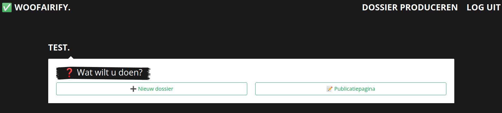
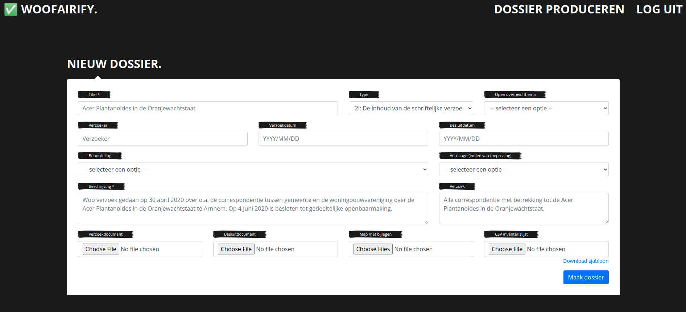
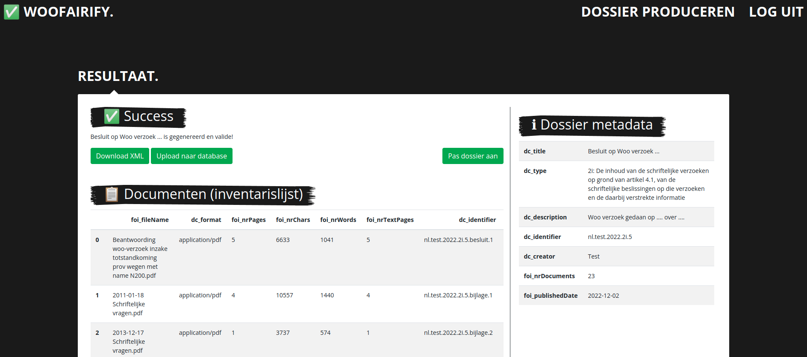
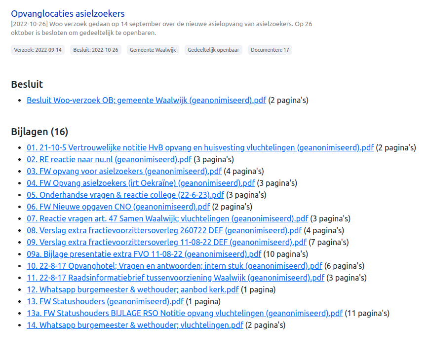
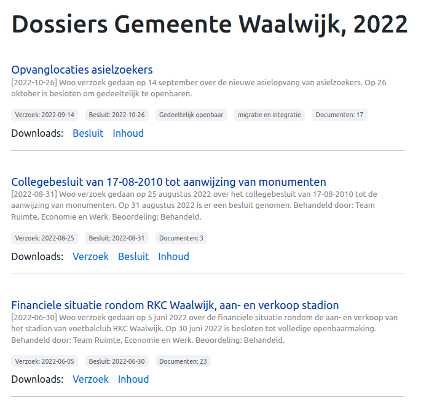
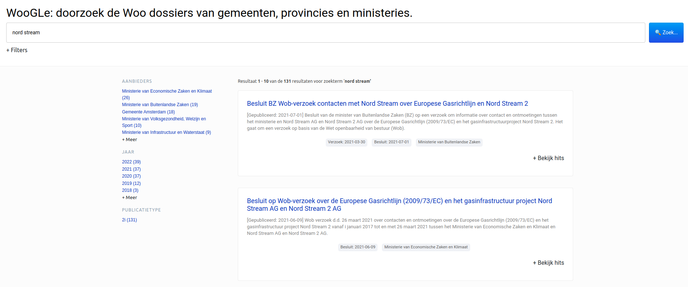

# FAIR Woo Content Management System
CMS om Woo-dossiers FAIR op te slaan, te publiceren, te doorzoeken en te delen. 

Auteurs:
- Maarten Marx (mmarx@uva.nl)
- Maik Larooij (larooij@uva.nl)

## ✅ Invoer
Nieuwe dossiers aanleveren kan via een gebruiksvriendelijke invoer-tool. Na een check kan het dossier worden toegevoegd aan de database en is deze direct zichtbaar in het publicatieoverzicht en vindbaar via de zoekmachine Woogle.

Dossiers kunnen ook in bulk worden aangeleverd, zie hiervoor de instructies:
- [Instructies (PDF)](aanleverinstructies/bulk_aanlevering.pdf)
- [Dossier sjabloon](aanleverinstructies/dossier_template.csv)
- [Document sjabloon](aanleverinstructies/document_template.csv)

## 📢 Publicatie
Door middel van het handige DOI-systeem zijn dossiers altijd op te vragen met enkel de DOI van een dossier of document. Ook prefixes van DOI's laten gemakkelijk overzichten zien, zoals alle dossiers van een aanbieder per jaar.

## 🔍 Woogle
Woogle maakt het mogelijk om alle dossiers in de database te doorzoeken. Het invoeren van een zoekterm ordent de resultaten op relevantie. Het ordenen gaat op basis van zowel de titel en beschrijving van een dossier, als de teksten in documenten. Dossiers kunnen verder worden gefilterd op bijvoorbeeld de aanbieder of het jaar van besluit, zodat deze zoekmachine ook intern te gebruiken is.

